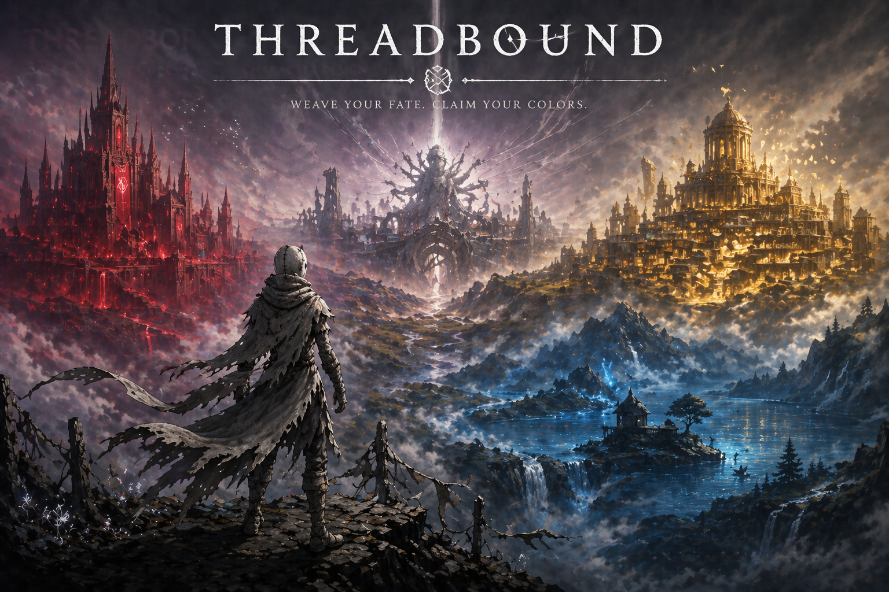
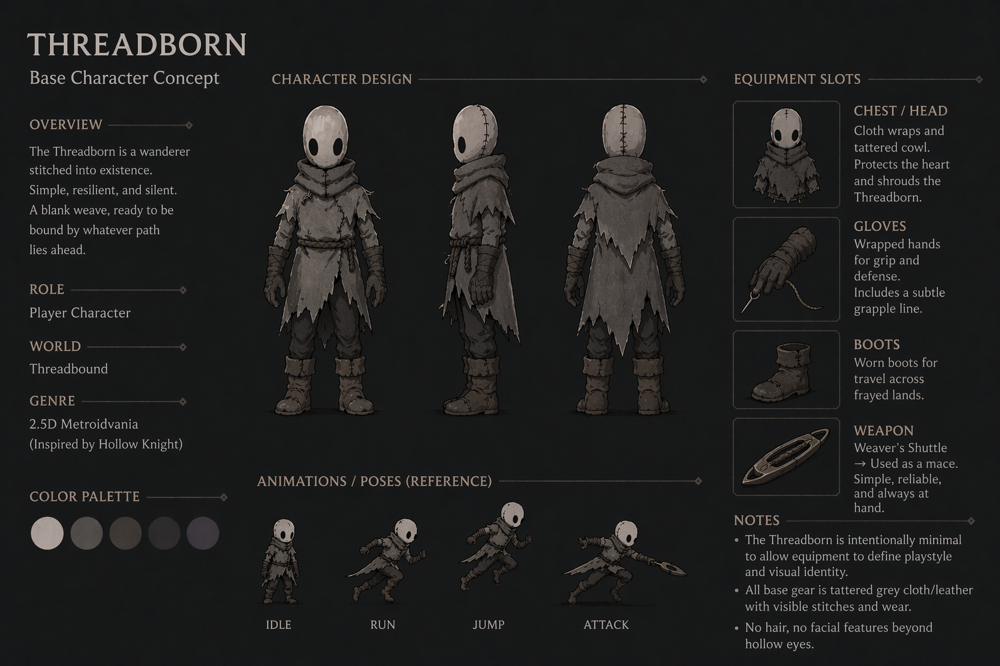
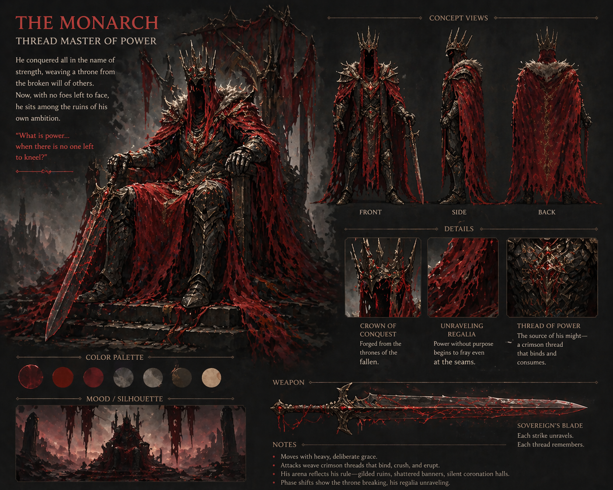
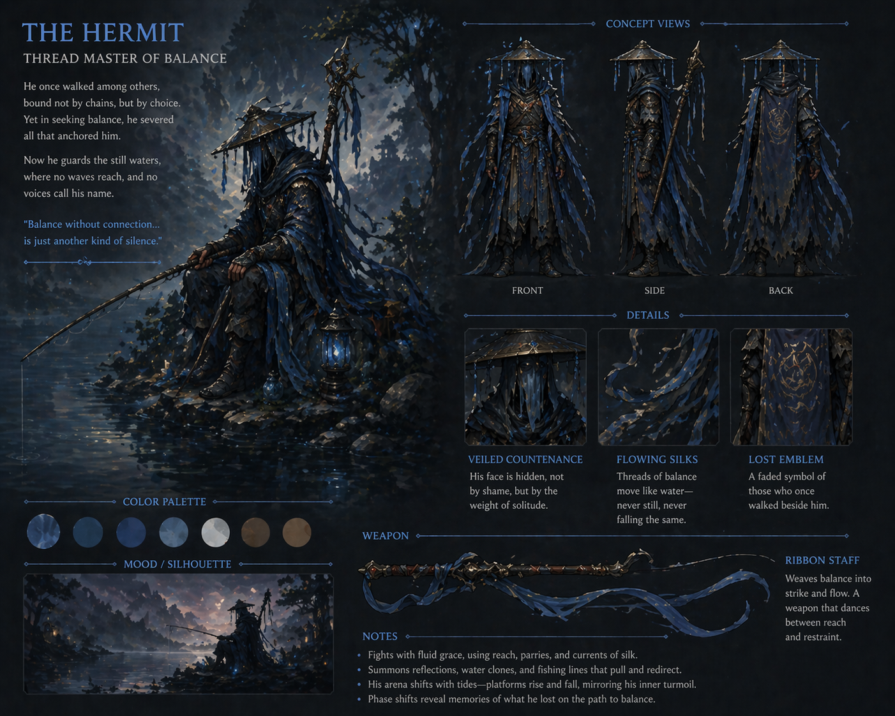
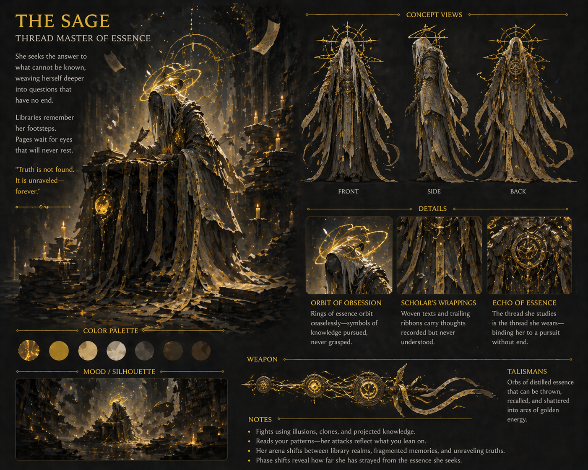

# Threadbound

 

> ⚠️ **License Notice**  
> This project is currently **All Rights Reserved**.  
> You may view the code and content, but **you may not reuse, redistribute, or create derivative works** without explicit permission.

---

**Threadbound** is a painterly 2D action metroidvania built in Godot, where you **weave abilities in real time during movement and combat**.

Slow time, swap gear mid-movement, and chain traversal and combat into a seamless flow as you shape your identity through the threads you choose to claim—or reject.

---

## 🧵 Core Concept

You are the **Threadborne** — the last unbound thread in a world once governed by a divine tapestry.

The Loom has been shattered. Fate is broken.

Now, every power you take… or refuse… reshapes who you become.

---

## 🌍 The World

Three beings now hold the primordial threads:

- 🟥 The Monarch — Power  
- 🟦 The Hermit — Balance  
- 🟨 The Sage — Essence  

To reach the shattered Loom and confront what remains, you must face them—and decide their fate.

---

## 👁️ Known Figures of the Tapestry

### 🧵 The Threadborne (You)

The last unbound thread.  
A silent form shaped entirely by your choices.

---

### 🟥 The Monarch — Power

A tyrant of strength and domination.  
Power demands to be taken.

---

### 🟦 The Hermit — Balance

A guardian of stillness and restraint.  
Balance demands to be understood.

---

### 🟨 The Sage — Essence

A seeker of truth and illusion.  
Essence demands to be questioned.

---

## ❓ And Others…

Not all threads reveal themselves so clearly.

Some follow.  
Some guide.  
Some wait.

---

## ⚔️ Key Features

### 🎮 Real-Time Weaving (Radial System)

At any moment, you can:

* Hold a button to **slow time**
* Open a **radial menu around the player**
* Instantly swap:

  * Grapple (Gloves)
  * Movement (Boots)
  * Utility (Head/Chest)
  * Weapon

Release → continue seamlessly.

No hard pauses. No menu friction.

> Build-crafting happens **inside gameplay**, not outside it.

---

### 🧰 Modular Equipment System

Each of the three Thread Masters provides a full gear set:

* **Gloves** → Grapple variants  
* **Boots** → Movement augments  
* **Head/Chest** → Utility abilities  

Gear is discovered throughout the world as **Dormant Threads**:

* Fully visible and styled  
* Minor passive effects  
* No full power yet  

---

### 🔥 Awaken or Refuse Power

After defeating a Thread Master, you must choose:

#### Absorb

* Awaken all collected gear of that type  
* Unlock full abilities  
* Add that color to your identity  

#### Spare

* Gear remains dormant  
* No abilities gained  
* Your form **desaturates toward white**  

---

### 🎨 Living Color System

Your appearance reflects your choices:

* Absorb power → gain color  
* Spare power → lose saturation  

Examples:

* Absorb Red → become red  
* Absorb Red + Blue → become purple  
* Spare → shift toward pale / white  
* Absorb all → descend toward black  

> You don’t pick a class.  
> You **become your decisions**.

---

## 🎨 Visual Identity

Your character is not customized in menus.

It evolves:

- Color reflects your choices  
- Equipment reflects your victories  
- Your silhouette tells your story  

No two players look the same.

---

### ⚔️ Weapons & Combat Flow

Each Thread Master unlocks a unique weapon style:

* **Red (Monarch)** → Greatsword (heavy, momentum-driven)  
* **Blue (Hermit)** → Ribbon Staff (flowing, precise)  
* **Yellow (Sage)** → Talismans (ranged, methodical)  

Weapons can be swapped mid-combat via the radial system, enabling:

* combo chaining  
* aerial transitions  
* high-skill expression  

Combat is fast, fluid, and always tied to movement.

---

### 🌍 Exploration Without Hard Gating

* The game is fully completable with the **base kit**  
* Equipment enhances:

  * speed  
  * expression  
  * access to secrets  

* No required abilities block core progression  

> Power transforms the experience—it doesn’t gate it.

---

### 🧵 Flow-State Gameplay

As you progress, you’ll:

* chain grapples, jumps, and attacks  
* swap gear mid-air  
* maintain momentum across entire encounters  

Endgame play becomes a **high-speed weaving of abilities**.

---

## 🧠 Design Pillars

* **Thread = Identity**  
  Your form, abilities, and visuals are shaped by your choices.  

* **Choice Matters**  
  Every boss decision has permanent mechanical and narrative impact.  

* **Flow-State Traversal**  
  Movement and combat are one continuous, expressive system.  

---

## 🕳️ Hidden Depths

For those who fully commit to their path…

There may be more waiting beyond the visible world.

Not all threads wish to be claimed.  
Some wish to be reclaimed.

---

## 🛠️ Tech

* Engine: **Godot 4**  
* Language: **GDScript**  
* Style: **Painterly 2D with 2.5D parallax**  

---

## 📂 Project Structure
threadbound/
├── README.md
├── CONTRIBUTING.md
├── LICENSE.md
│
├── docs/ # Design, narrative, systems
├── src/ # Game code (player, systems, etc.)
├── assets/ # In-game assets
├── addons/ # Plugins (e.g., Phantom Camera)

---

## 🚧 Current Focus

* Equipment system (radial + swapping)  
* Base player controller  
* Combat flow integration  
* Boss + gear interactions  

---

## 🤝 Contributing

See `CONTRIBUTING.md` for setup, structure, and guidelines.

---

## 🧵 Vision

Threadbound is about more than power.

It’s about:

* what you choose to take  
* what you choose to leave behind  
* and what that makes you  

---

**Let’s weave something unforgettable.**