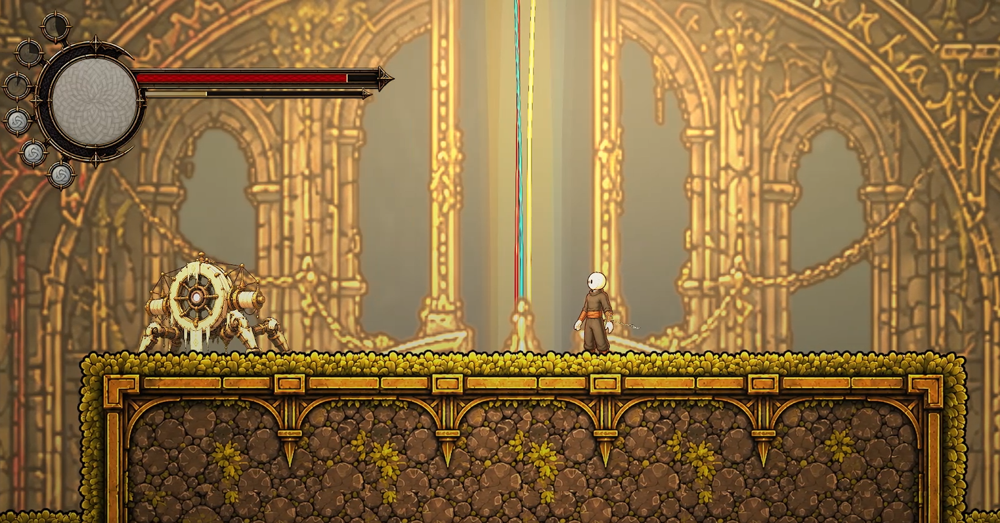
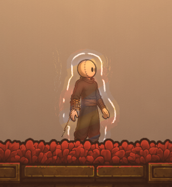
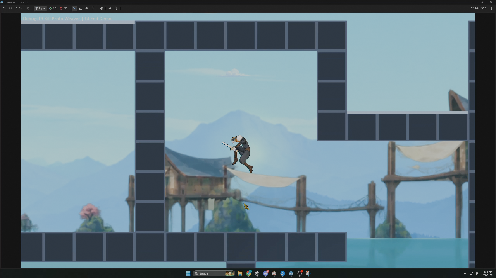
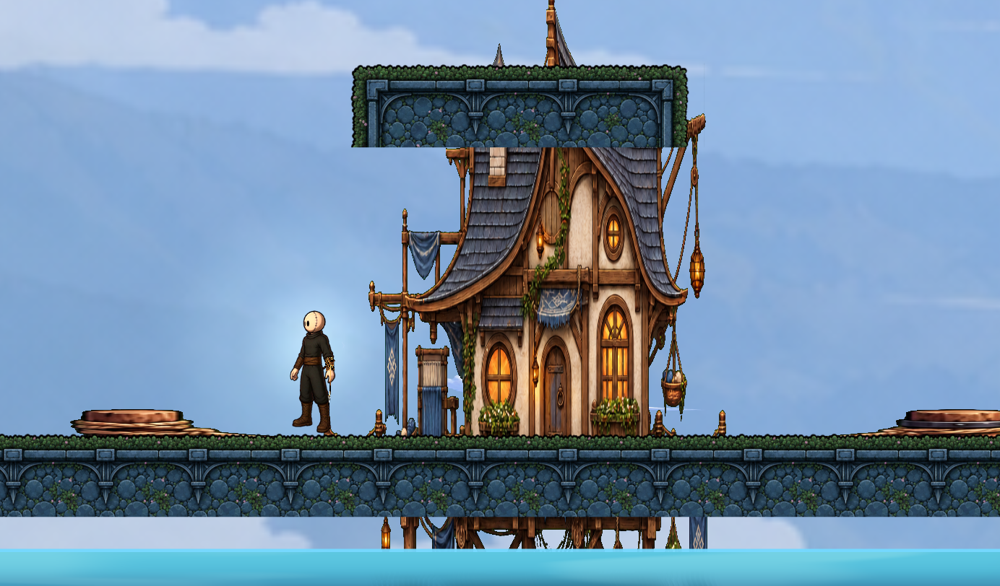
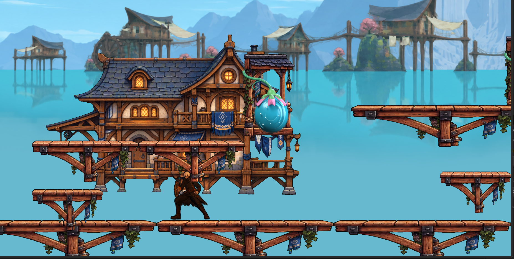
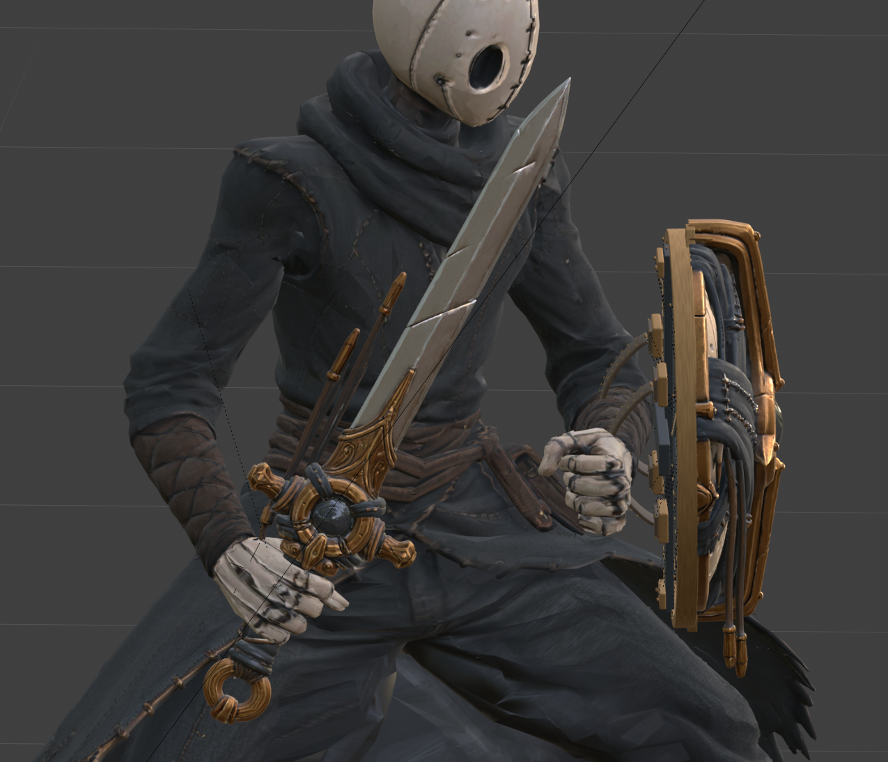
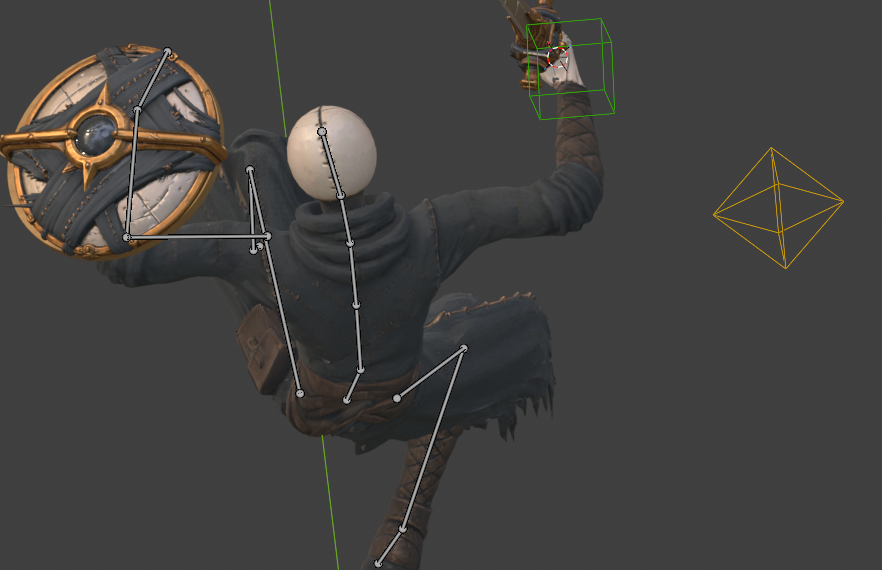

# Devlog #4 — From the Demo to Now

It's been a while since I sat down and put a proper update together. I've been working on Threadbound in a lot of small pieces, and looking through the project again made me realize how much there is to talk about.

This is a catch-up on where the game has been going around the demo and since then. Some of the earlier combat and visual work helped shape the demo itself; the lakeside region and the character experiments are where a lot of my attention has gone more recently.

There's still plenty here that's unfinished. This is my solo hobby project, and some of these ideas are things I'm trying out in playable test rooms rather than finished features ready for a new download. But I wanted to show the work, including the parts I'm still figuring out.

*The Chamber in an August development capture—the starting point for this catch-up.*

## Getting the attacks to read properly

A surprising amount of combat work has been about making the character actually communicate what the attack is doing.

Earlier on, that meant a lot of sprite cleanup: keeping the character a consistent size, repairing clipped weapon swings, fixing frames that jumped around, and giving attacks a little more anticipation and follow-through. Standing still, moving forward and backing away also needed to look different without the animation suddenly changing halfway through a swing.

That work became the older sprite combat setup, with a moving opener and double-sweep finish, a separate stationary double hit, and backpedaling variants. I also gave the downward pogo strike its own animation so it looked like a deliberate downward attack instead of a borrowed part of another move.

More recently, the new character experiment has meant revisiting the attacks again. The current ground combo takes one continuous animation and breaks it into three strikes that you trigger individually. I'm working on making each contact line up with the sword, instead of asking the effects to hide a mismatch between the animation and the hit.

One very literal example: the second swing was registering too late, after the weapon had already passed through the useful forward part of its arc. Its damage and effect timing have now been moved to that actual sweep. The third strike has also had attention on its overhead arc and where it meets the floor.

Air attacks have probably been the most iterative part. I've tried several versions, including ones that relied too much on rotating the arm toward the aim direction. Those could technically point the sword correctly and still look awkward in motion.

The current version uses authored forward, upward and downward attacks. The upward move is a quick thrust, and the downward pose brings the blade below the feet for pogoing. I've been adjusting their extension and recovery so they respond quickly without losing the pose. They're integrated into the working game now, but I'm still judging them in motion rather than calling them finished.

There's also a directional ground special: holding left or right gives you a traveling spin, while using Special without a direction keeps the neutral explosion. Standing and crouched blocking are being tested too, with protection depending on which way you're facing. Perfect blocks and parries aren't part of that yet.

## Flow State: making the effects fit the character

Flow has gone through a couple of different visual stages.

The earlier overhaul moved toward something that felt woven around the player: a bright core, strands of light, and separate Thread colors. I wanted the effect to communicate that you've built momentum while still letting you see your character and what you're fighting.

*The earlier sprite-era Flow treatment. This is a July capture, before the current model-based version.*

With the live model, I've been simplifying that presentation again. Some of the old effects no longer lined up with the weapon or the body, particularly the detached attack crescents. Keeping all of them just because they already existed wasn't helping readability.

The current experiment uses the actual character silhouette and shorter, more restrained afterimages. Several of the old bursts and movement effects have been removed from the active presentation, and the sword has its own effects following the attack.

The aim is still to make Flow feel powerful. I'm trying to get there through a clear pose and readable motion, with room left on screen for enemies and platform edges. This part of the work is about how Flow looks and communicates, rather than introducing a new set of Flow stats.

## Water is becoming part of the movement

The Blue-region experiments have pushed me to think about water as something you can move through and use in a route.

I've been working on swimming momentum, steering, carrying speed out of the water and getting control back naturally after a breach. An early problem was that normal air movement could wipe out the launch almost as soon as you left the surface. A lot of the tuning has been about preserving that movement while still letting you redirect it.

There are now bank-side dive prompts in the test setup, alongside ordinary falls into water. Underwater visibility has needed attention too. It doesn't matter how interesting the movement is if the water hides the character or makes it difficult to understand the boundary of a dry pocket.

Swimming attacks have their own ongoing work. The current version blends between idle and moving water-attack poses so the body can retain its swimming motion. It is still a limited forward-slash setup, not a full underwater combo system, and hitting downward underwater doesn't bounce you as pogo does in the air.

The water bulbs have been another fun thing to explore. They're regenerating objects with different responses depending on what you do:

- Hit one with a melee attack and it pushes you opposite the strike.
- Dash through one and it carries your momentum onward with an upward boost.
- Pop one remotely and you clear it without launching yourself.

I've put those choices into a small test room with alternate routes and a floor to recover on when a chain goes wrong. The question I'm testing is whether one recognizable object can give you several useful ways through a space, including on the way back.

*A frame from the September 26 lake test. The blocky geometry is still there because this room is being used to work on movement and combat.*

There have also been smaller traversal fixes around the existing kit, including controller grapple aim assistance and separating jump from interaction. Those are easy changes to overlook in a screenshot, but missed hooks and accidental interactions can interrupt the whole sequence you're trying to put together.

## Building a place beyond the chamber

The Blue region has been growing through a mixture of art studies and playable greyboxes: lake-slate terrain, rooftops, wooden platforms, clouds, houses and water treatments.

*An August rooftop and house study.*

I've also been trying a village composition that mixes the painted buildings and platforms with rendered water bulbs and layered backgrounds. There has been a lot of small work on how things meet: platform art lining up with landing surfaces, house supports disappearing into the water properly, and the bulb petals opening and reforming around the water inside.

*The September village composition experiment. This is an art/playground study, not a finished region reveal.*

I'm still comparing materials and proportions. Some of the newer pieces need more of the broad grain, worn edges and uneven character of the painted houses. Putting everything in the same room makes those differences much easier to see.

I've been keeping the movement tests fairly plain while doing this. It's useful to be able to strip the decoration back and ask whether the room itself is enjoyable to move through before spending more time dressing it.

## Enemies for the lake

Two early enemies are now in the lake test.

Reedhook is a fairly straightforward platform enemy. He plants his feet, raises the hook, then steps into a sweep. He commits to his facing, so getting behind him matters, and there's an opening during recovery. He also needs to respect the platform edges instead of wandering straight into the lake.

The Tide Duelist is the underwater counterpart: a swordfish-like enemy that curls into a draw stance, gives an eye-flash tell and then commits to a dash. I've been checking that it stays in the water, stops at obstructions and doesn't damage you just for touching it during idle or recovery.

Both can be interrupted by a hit. Both are still first passes. The fish's dash especially still needs the right feeling of a readable warning followed by a sharp committed strike.

The Proto-Weaver also had a lot of work during the earlier demo push—encounter tuning, traversal sections, presentation and its death sequence. That belongs to the history of getting the demo into shape; the recent enemy work has been focused on these Blue-region experiments.

## The less photogenic work

There has been a steady stream of smaller fixes around menus, prompts and getting back into play.

The release-window cleanup included clearer inventory selection and controller tabs, better merchant spacing and interaction behavior, lore notifications and guidance, and fixes for the camera after save-point or merchant interactions. Cancelling a menu also shouldn't turn into an accidental dash.

Death recovery has had attention, including cases where the game-over state could leave you stuck. Thread Knots now have a recoverable pile with saved currency and location information, giving you something to return for after dying.

Audio has been a smaller part of this stretch. A lot of its foundation was already there before the release candidate. The later work includes correctly stopping game-over music during recovery; I don't have a big new soundtrack overhaul to announce.

I've also built more room-authoring tools so I can reshape water, platforms and routes before committing to finished art. It's behind-the-scenes work, but it helps me spend more time testing how a room plays.

## The big experiment: rebuilding the Threadborne with a 3D model

This is probably the largest change in how I've been working lately.

I've been experimenting with a rigged 3D Threadborne, first rendering animations into 2D frames and then testing the model rendered live inside the 2D game. The game still uses its side-on movement and collision; the experiment is in how the character is animated and drawn.

*An early equipped-model close-up from September.*

That has involved a lot more than putting a model in the scene. Shoulders have to deform properly, fingers need to hold the weapon, the shield needs to sit on the arm, and everything has to stay readable from the gameplay camera. An animation that looks fine while orbiting around it in Blender can be much less convincing from the side.

I've been using transferred animation clips as a starting library and doing more specific work where the game needs it, especially the aerial attacks. The latest set includes an authored forward swing and separate up/down poses, rather than asking one animation to cover every direction.

*Working on the aerial poses in Blender.*

The model is now connected to the player scene in the current project, so this has moved beyond a static comparison. But it is still an experiment. Lighting, outlines, sword visibility, character scale and how it sits beside the painted environment all need to work together. More animation clips on disk don't automatically mean more finished moves in the game.

One thing I like about this direction is being able to go back into a pose and work on the relationship between the whole body and the weapon. That's also where a lot of the remaining work is: making the movement feel intentional all the way through, including the transitions back out of an attack.

## Where I'm going next

Right now I want to spend more time playing these pieces together: the lake movement, the new enemies, the attack animations and the feedback around them. Some recent changes still need that normal-speed, controller-in-hand judgment that a technical check can't give me.

The overall direction is still the same: movement, combat and equipment should give you ways to express yourself and keep a sequence going. I want the rooms to give those choices somewhere interesting to happen.

Thanks for following along while I work through it. If you have thoughts on the character experiment, the attack readability or the look of the lakeside area, I'd be interested to hear them.
